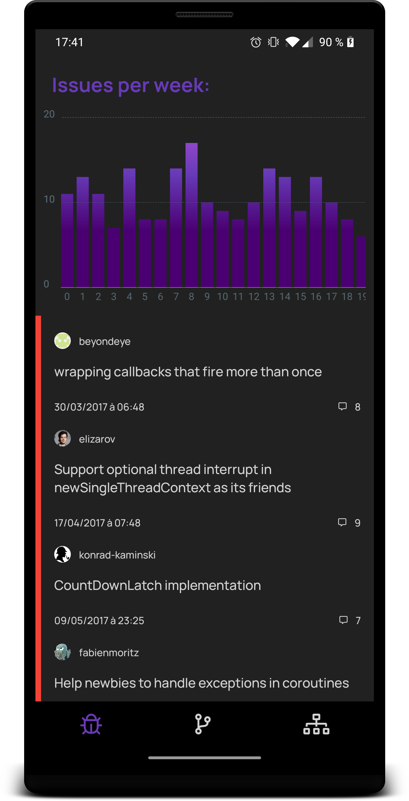

# Github Android client

This project is the implementation of a hiring technical test for Datadog.


## Technical test

#### Overview

- Create an iOS or Android application that allows a user to login via Github. You can use any tools or libraries you deem useful.
- Display a list of the public repositories for the said user
- Allow the user to select a repository
- Display in the application the key statistics as well as a history of the number issue over the past year in 1 week intervals for the selected repository. We’d suggest a graphical representation like a timeseries. Make it easy for the end-user to picture the situation!
- Explain how you'd improve on this application design

#### Deliverable

- Your solution should be returned as an archive of the code.
- It should include a README that contains the instructions on how to run the application and configure it if needed
- The application should not be published to the App Store / Play Store


## Demo

<p>
  
  
</p>

## Build


#### 0. Requirement

This project requires Android Studio **4.0**.

There's a Gradle wrapper, otherwise, it requires Gradle **6.4.1**.

#### 1. Create your Github app

Follow the steps [here](https://github.com/settings/applications/new) in order to create your own oAuth application.

#### 2. Copy your oAuth app keys

In `local.properties`, add the following parameters using the keys you got in step 1 :

| Key | Value |
|---|---|
| `GITHUB_CLIENT_ID` | Github Client ID (see step 1) |
| `GITHUB_SECRET` | Github Client Secret (see step 1) |

#### 3. (optional) Force to use a repository with a large amount of issues

If you want to test using a repository with a large amount of issues, go in `RepositoryListController.onRepositoryClicked()` and change the following line :

```kotlin
navigator.navigateTo(REPO_DETAILS, mapOf(EXTRA_REPO_NAME to repositoryName, EXTRA_OWNER_LOGIN to ownerLogin))
```

by 

```kotlin
navigator.navigateTo(REPO_DETAILS, mapOf(EXTRA_REPO_NAME to FAKE_REPOSITORY, EXTRA_OWNER_LOGIN to FAKE_OWNER_LOGIN))
```

It'll fetch Kotlin's coroutines Github repository.

#### 4. Read to launch

Now, you can simply build an apk pointing to the module `:app`.

#### APK

There's also an APK (with my Github oAuth App keys) in the root folder (`demo.apk)`.

## Libraries used

| Library | Purpose |
|---|---|
| [Coroutines](https://kotlinlang.org/docs/reference/coroutines-overview.html) | Multithreading |
| [ShimmerLayout](https://github.com/team-supercharge/ShimmerLayout) | Loading view |
| [Coil](https://coil-kt.github.io/coil/) | Image loader |
| [JGraph](https://github.com/ZuYun/Jgraph) | Graph view |
| [Koin](https://insert-koin.io/) | Dependency Injection |
| [Mockito](https://site.mockito.org/) | Mock for Unit tests |
| [Retrofit](https://site.mockito.org/) | HTTP Rest client |
| [Apollo](https://www.apollographql.com/docs/android/) | GraphQL client |
| [Timber](https://github.com/JakeWharton/timber) | You always need Timber |


## Architecture explanation

See `architecture.md`

## Potential design amelioration

### 1. Optimize GraphQL data model

Some GraphQL data are duplicated. It's due to Apollo's code generation. It makes some RemoteMapper a bit stupid like RemoteUserMapper


```kotlin
    override fun map(user: FetchUserPublicRepositoriesQuery.Owner) = User(
        login = user.login(),
        avatarUrl = (user.avatarUrl() as? String)
    )

    override fun map(user: FetchRepositoryDetailsQuery.Owner) = User(
        login = user.login(),
        avatarUrl = (user.avatarUrl() as? String)
    )

    override fun map(user: FetchRepositoryForksQuery.Owner) = User(
        login = user.login(),
        avatarUrl = (user.avatarUrl() as? String)
    )
```

It was my first time using GraphQL, so I don't really know what would be the solution here but I expect some kind interface logic here. I need to read more Apollo's doc.

### 2. Redudant interactors and RemoteServices

Some interactors (`IssuesInteractor`, `ForksInteractors` and 
PullRequestsInteractors`) are doing exactly the same things. It's duplicated.

A better design would probably to use [Composition by Delegation](https://kotlinlang.org/docs/reference/delegation.html) or simply using inheritance with generics.

The same problems occurs for `RemoteIssuesService`, `RemoteForksService` and `RemotePullRequestsService`.

### 3. LiveData exposition in ViewModels

The LiveDatas in the ViewModels are public (so it can be observed by an Activity/Fragment.
But, it makes it possible to write in it. In my small application, it's not a big deal, but in a large app or library, it could pose problems.

A simple solution would be to expose a getter of LiveData (and not MutableLiveData) like this:

```kotlin
    val issuesListLiveData: LiveData<List<IssueViewState>>
        get() = _issuesListLiveData

    override fun displayIssueList(issuesListViewState: List<IssueViewState>) {
        _issuesListLiveData.postValue(issuesListViewState)
    }
```

## Encountered problems

### 1. Filter by date issue

##### Problem

The filter in Github API "since" doesn't work.

See https://github.community/t/how-to-filter-issues-between-two-dates-in-github-v4-graphql-api/14279

##### Solution

So, I had to fetch issues by pages and stop when I receive an outdated issue.
It prevent the app to be able to know how many issues are being downloaded, but it avoid to download all issues of a repository before displaying the timeserie.

### 2. Crash in the Jchart library

##### Problem

The library I used to make the timeserie chart was really buggy.

I initially intended to display the chart in a recyclerview so it would scroll as the rest of the issues. Unfortunately, it was systematically crashing. It was probably too late to find another library and I didn't find a solution to this.

##### Solution

The solution is more a workaround. Now the chart is fixed on the top and not in the recyclerview. It's not perfect but at least, it doesn't crash. If I would have more time, maybe I would recode the chart view by myself.


### 3. Bug in `kotlin.Result` with coroutines

##### Problem

I initially tried to use the Kotlin `Result`, but I faced issues when using it in coroutines. 

More infos here: https://youtrack.jetbrains.com/issue/KT-27586


The problem has been solved, but only in 1.4M2 (and the project uses 1.4M1).

##### Solution

I solved the issue by copying the Result class into another which I called "Monad" because the principle is the same.