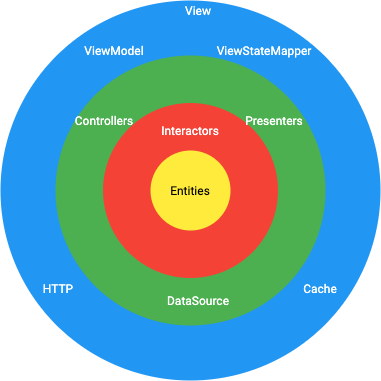
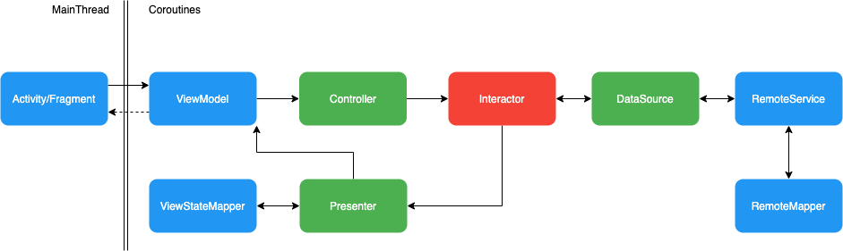

# Architecture

This project follows an implementation of [Clean Architecture](https://blog.cleancoder.com/uncle-bob/2012/08/13/the-clean-architecture.html).



## Components

#### Entities
The entities represent the business model data.

#### Interactors (also called Use Case)
The Interactors represent the business logic.

#### Controllers
The Controllers are in charge of receiving UI inputs and trigger relevant Interactor.

For example, "When the view is loading, fetch the list of repositories" will gives:

```kotlin
override suspend fun onViewReady() {
   fetchUserPublicRepositoriesUseCase.fetchUserPublicRepositories()
}
```

They also can be in charge of navigation between views.

#### ViewStateMappers
The view should always have its own model. That's why the ViewStateMappers are in charge of mapping entities (used for the businesse logic) into ViewState (the model of the view).


#### Presenters
The Presenters are the links between Interactors and View. They use ViewStateMapper to convert the entities into ViewState.

They also can be in charge of navigation between views.


#### ViewModels
The ViewModel are used like views. 
They delegate the UI inputs to the controllers.
They also saves the ViewStates in LiveDatas so the Fragment/Activity can observe them in a classic [MVVM pattern](https://en.wikipedia.org/wiki/Model%E2%80%93view%E2%80%93viewmodel).

#### DataSources
The DataSources are in charge of providing datas from remote or local sources.

They also can merge data if needed (if some data are in different sources).

#### RemoteServices/LocalServices
The RemoteService are in charge of performing simple HTTP queries (or SQL if it's in local database).

#### RemoteMappers
The role of RemoteMappers is to map data from remote model (the model used in APIs) into entities.

## Call flow



When a `View` receives an input (`onCreate()`, `onActivityCreated()`, `onClick()`, etc...), it transmit it to its `ViewModel` then the `Controller` call the relevant `Interactor`.

The `Interactor` get data from its `DataSources`, then performs business logic.
When the `View` needs to be updated, the `Interactor` calls its `Presenter`.

The `Presenter` maps the `Entities` into `ViewState` and pass it to `ViewModel`.

The `Activity/Fragment` observes `LiveDatas` from the `ViewModel` and can update the real view.

## Gradle modules

The project tends to respect a main principle:
- One Gradle module per feature.

It makes it clear to understand a feature's Gradle module.

Some other modules respect the Clean Architecture layer isolation (like `datasource` or `service`).

Note: 

It's not because a feature module contains several Clean Architecture layers that they don't respect the layer isolation pattern.


## Navigation

The Navigation between views is inspired by the Navigation pattern used at Aircall.

See more details here: https://medium.com/inside-aircall/why-did-we-move-away-from-navigation-component-f2160f7c3f4b

Note: 

It's not the real implementation but a very simplified version (enough for a small project).